# Flowchart v0.5.x

> The [Flowchart-SchemaEditor.svg](./Flowchart-SchemaEditor.svg) is for `0.4.x`.
>
> This overview has fewer details than the previous one, as now many parts are more flexible and agnostic to the render strategy.
>
> But it's also simpler, as the `UIRootRenderer` is removed and entrypoints go directly over `WidgetEngine`. While rendering responsibility is stricter separated and encapsulated with `Next`.

## Flowchart React

Architecture overview of UI-Schema for React.

- Setup: can be outside of render flow
    - setup `binding` with `widgets`, `widgetPlugins` and base components
    - initialize `Validator`
- Meta Level: shared context for store/schema levels
    - `UIMetaProvider` receives `binding`, `t` and `validate`
    - materializes `binding.widgetPlugins` and `binding.WidgetRenderer` as a widget render pipeline, available as `Next` prop
    - allows supplying more props, which are injected in `WidgetEngine` as default props for the rendering pipeline
- Store / Schema Level: rendering the UI, using data and schema
    - `WidgetEngine` receives props with storeKeys (the "location") and schema
        - connects to store and extracts `value` and `internal` for the current location
        - connects to meta context and fetches the `binding` (and all else)
        - starts rendering of materialized widget render pipeline
        - in the widget rendering pipeline, after all plugins, the `WidgetRenderer` is expected to match and render the final widget

```mermaid
flowchart TD
    subgraph Setup [Setup]
        BindingSetup["Setup binding:\n- widgets\n- widgetPlugins\n- base components"]
        ValidatorInit["Initialize Validator"]
    end

    subgraph MetaLevel [Meta Level]
        UIMetaProvider["UIMetaProvider\n(receives binding, t, validate, additional props)"]
        MaterializePipeline["Materialize Widget Render Pipeline:\n- binding.widgetPlugins\n- binding.WidgetRenderer"]
        MetaContextNext["'Next' exists"]
        MetaContextChildren["React children"]
    end

    subgraph AppPage
        Page["Your App Content"]
    end

    subgraph SchemaLevel["Store / Schema Level"]
        WidgetEngine["WidgetEngine\n(receives storeKeys, schema, ...props)"]
        ExtractValue["Connect to store:\n- extract value\n- extract internal"]
        ConnectMeta["Fetch from meta:\n- binding\n- render pipeline\n- t + validate\n- default props"]
        StartPipeline["Render 'Next'"]
    end

    RecursiveChild["nested fields:\n→ Render WidgetEngine(s)"]

    subgraph RenderPipeline["Render Pipeline"]
        RenderPipelineStart["Start Pipeline"]
    %% note: these states are explaining "how it behaves",
    %%       but as it is materialized, the "if remains" is already done in UIMetaProvider
        CheckPlugins["any plugin remains?"]
        RenderPlugin["Render Plugin, inject 'Next' prop"]
        RenderNextPlugin["Plugin renders 'Next'"]
        NoPlugins["No plugins remaining"]
        FinalRender["WidgetRenderer\n(matches + renders final widget)"]
    end

    BindingSetup --> UIMetaProvider
    ValidatorInit --> UIMetaProvider
    UIMetaProvider --> MaterializePipeline
    MaterializePipeline --> MetaContextNext
    MetaContextNext --> MetaContextChildren
    MetaContextChildren --> Page
    Page --> WidgetEngine
    WidgetEngine --> ExtractValue
    WidgetEngine --> ConnectMeta
    ExtractValue --> StartPipeline
    ConnectMeta --> StartPipeline
    StartPipeline --> RenderPipelineStart
    RenderPipelineStart --> CheckPlugins
    CheckPlugins -- yes --> RenderPlugin
    RenderPlugin --> RenderNextPlugin
    RenderNextPlugin --> CheckPlugins
    CheckPlugins -- no --> NoPlugins
    NoPlugins --> FinalRender
    FinalRender --> RecursiveChild
    RecursiveChild -- recurse --> WidgetEngine

```

## Flowchart React with JSON Schema

> todo: a more in depth flow chart, which focuses on how object rendering works by default; including `$ref` handling(?)
